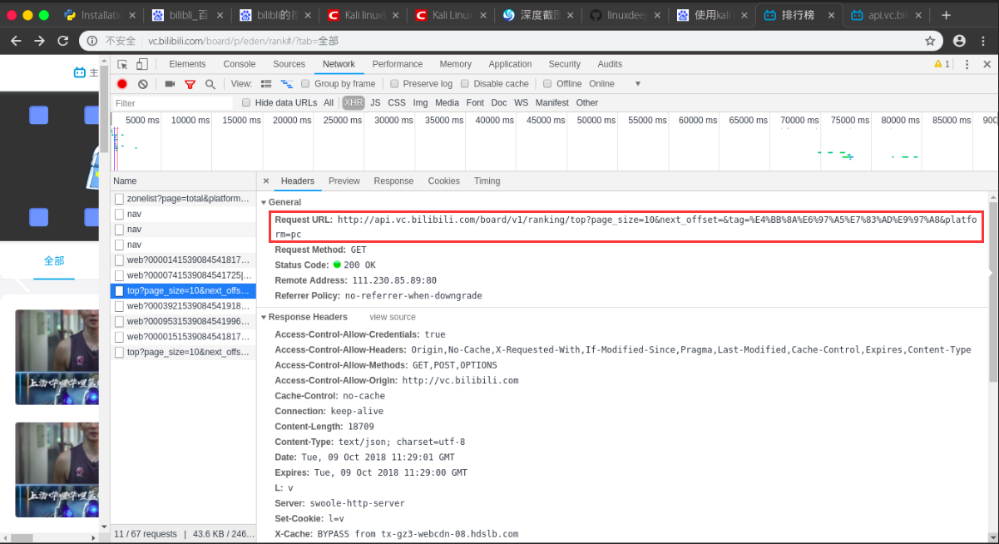
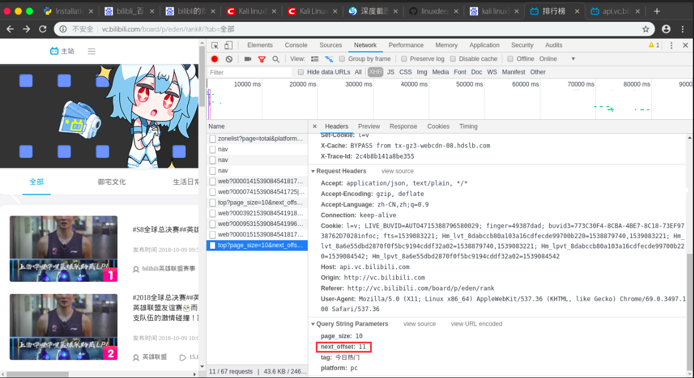
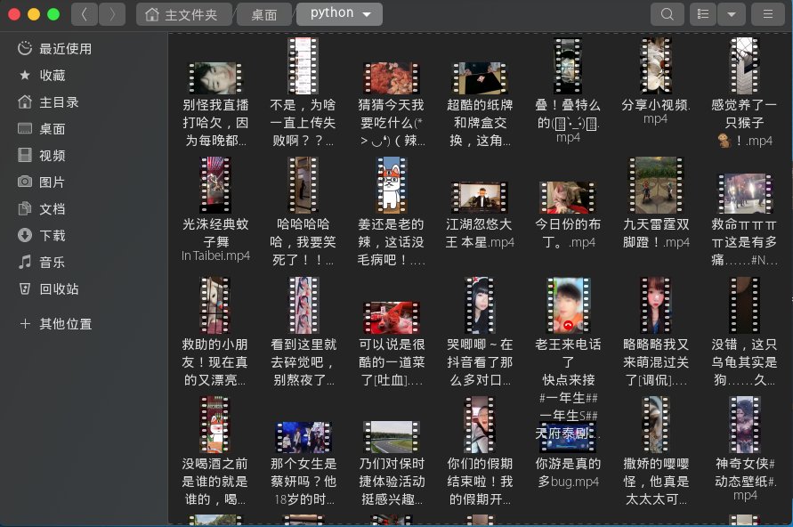

## bilibili-smallvideo

### 如何手动写一个 `Python` 脚本自动爬取 `Bilibili` 小视频


国庆结束之余，某个不务正业的码农不好好干活，在B站瞎逛着，毕竟国庆嘛，还让不让人休息了诶～～

我身边的很多小伙伴们在朋友圈里面晒着出去游玩的照片，简直了，人多的不要不要的，长城被堵到水泄不通，老实人想想啊，既然人这么多，哪都不去也是件好事，没事还可以刷刷 `B` 站 `23333` 。这时候老实人也有了一个大胆地想法，能不能让这些在旅游景点排队的小伙伴们更快地打发时间呢？考虑到视频的娱乐性和大众观看量，我决定对 `B` 站新推出的小视频功能下手，于是我跑到B站去找API接口，果不起然，B站在小视频功能处提供了 `API` 接口，小伙伴们有福了哟！


`B` 站小视频网址在这里哦：

```
http://vc.bilibili.com/p/eden/rank#/?tab=全部
```

此次实验，我们爬取的是每日的小视频排行榜前 `top100`

我们该如何去爬取呢？？？

### 实验环境准备

- `Chrome` 浏览器 (能使用开发者模式的浏览器都行)
- `Vim` (编辑器任选，老实人比较喜欢Vim界面，所以才用这个啦)
- `Python3` 开发环境
- `Kali Linux` (其实随便一个操作系统都行啦)

### `API` 寻找 `&&` 提取

我们通过 `F12` 打开开发者模式，然后在 `Networking ->  Name` 字段下找到这个链接：

```
http://api.vc.bilibili.com/board/v1/ranking/top?page_size=10&next_offset=&tag=%E4%BB%8A%E6%97%A5%E7%83%AD%E9%97%A8&platform=pc
```

我们查看一下  `Headers` 属性



我们可以看到Request URL这个属性值，我们向下滑动加载视频的过程中，发现只有这段url是不变的。

```
http://api.vc.bilibili.com/board/v1/ranking/top?
```

`next_offset` 会一直变化，我们可以猜测，这个可能就是获取下一个视频序号，我们只需要把这部分参数取出来，把 `next_offset` 写成变量值，用 `JSON` 的格式返回到目标网页即可。



### 代码实现

我们通过上面的尝试写了段代码，发现 `B` 站在一定程度上做了反爬虫操作，所以我们需要先获取 `headers` 信息，否则下载下来的视频是空的，然后定义 `params` 参数存储 `JSON` 数据，然后通过 `requests.get` 去获取其参数值信息，用 `JSON` 的格式返回到目标网页即可，实现代码如下：

```python
def get_json(url):
    headers = {
        'User-Agent': 
        'Mozilla/5.0 (X11; Linux x86_64) AppleWebKit/537.36 (KHTML, like Gecko) Chrome/69.0.3497.100 Safari/537.36'
    }

    params = {
        'page_size': 10,
        'next_offset': str(num),
        'tag': '今日热门',
        'platform': 'pc'
    }

    try:
        html = requests.get(url,params=params,headers=headers)
        return html.json()

    except BaseException:
        print('request error')
        pass

```

为了能够清楚的看到我们下载的情况，我们折腾了一个下载器上去，实现代码如下：

```python
def download(url,path):
    start = time.time() # 开始时间
    size = 0
    headers = {
        'User-Agent': 
        'Mozilla/5.0 (X11; Linux x86_64) AppleWebKit/537.36 (KHTML, like Gecko) Chrome/69.0.3497.100 Safari/537.36'
    }

    response = requests.get(url,headers=headers,stream=True) # stream属性必须带上
    chunk_size = 1024 # 每次下载的数据大小
    content_size = int(response.headers['content-length']) # 总大小
    if response.status_code == 200:
        print('[文件大小]:%0.2f MB' %(content_size / chunk_size / 1024)) # 换算单位
        with open(path,'wb') as file:
            for data in response.iter_content(chunk_size=chunk_size):
                file.write(data)
                size += len(data) # 已下载的文件大小
```

效果如下：


将上面的代码进行汇总，整个实现过程如下：

```python
#!/usr/bin/env python
#-*-coding:utf-8-*-
import requests
import random
import time
def get_json(url):
    headers = {
        'User-Agent': 
        'Mozilla/5.0 (X11; Linux x86_64) AppleWebKit/537.36 (KHTML, like Gecko) Chrome/69.0.3497.100 Safari/537.36'
    }

    params = {
        'page_size': 10,
        'next_offset': str(num),
        'tag': '今日热门',
        'platform': 'pc'
    }

    try:
        html = requests.get(url,params=params,headers=headers)
        return html.json()

    except BaseException:
        print('request error')
        pass

def download(url,path):
    start = time.time() # 开始时间
    size = 0
    headers = {
        'User-Agent': 
        'Mozilla/5.0 (X11; Linux x86_64) AppleWebKit/537.36 (KHTML, like Gecko) Chrome/69.0.3497.100 Safari/537.36'
    }

    response = requests.get(url,headers=headers,stream=True) # stream属性必须带上
    chunk_size = 1024 # 每次下载的数据大小
    content_size = int(response.headers['content-length']) # 总大小
    if response.status_code == 200:
        print('[文件大小]:%0.2f MB' %(content_size / chunk_size / 1024)) # 换算单位
        with open(path,'wb') as file:
            for data in response.iter_content(chunk_size=chunk_size):
                file.write(data)
                size += len(data) # 已下载的文件大小

    

if __name__ == '__main__':
    for i in range(10):
        url = 'http://api.vc.bilibili.com/board/v1/ranking/top?'
        num = i*10 + 1
        html = get_json(url)
        infos = html['data']['items']
        for info in infos:
            title = info['item']['description'] # 小视频的标题
            video_url = info['item']['video_playurl'] # 小视频的下载链接
            print(title)

            # 为了防止有些视频没有提供下载链接的情况
            try:
                download(video_url,path='%s.mp4' %title)
                print('成功下载一个!')
                
            except BaseException:
                print('凉凉,下载失败')
                pass

        time.sleep(int(format(random.randint(2,8)))) # 设置随机等待时间

```

爬取效果图如下：




似乎爬取的效果还可以，当然喜欢的朋友不要忘记点赞分享转发哦。

我的公众号是**IT老实人(IThonest)**，一个有故事的公众号，欢迎大家来这里讨论，共同进步，不断学习才能不断进步。扫下面的二维码或者收藏下面的二维码关注吧(长按下面的二维码图片、并选择识别图中的二维码)

<p></p>
